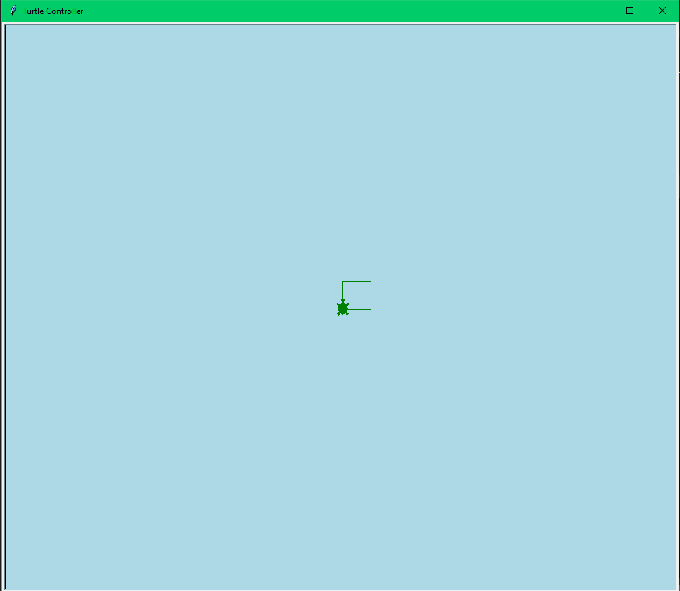
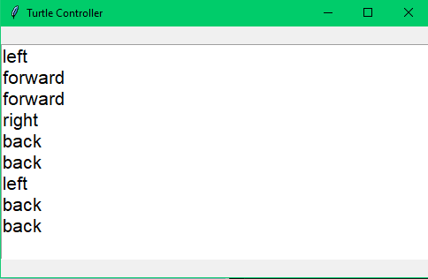
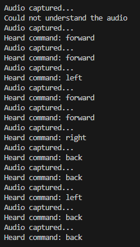

# Voice Command Turtle Controller

This project is a voice-controlled turtle graphics application using Python. It utilizes the `speech_recognition` library to capture voice commands and control a turtle in a graphical window. Additionally, it maintains a history of recognized commands displayed in a Tkinter window.

## Features

- Voice recognition using the Google Web Speech API.
- Turtle graphics controlled by voice commands.
- Real-time display of command history in a Tkinter window.

## Requirements

- Python 3.x
- `speech_recognition` library
- `tkinter` library (usually included with Python)
- `pyaudio` library (for microphone input)
- `turtle` library (usually included with Python)

## Installation

1. Clone the repository:

   ```bash
   git clone https://github.com/yourusername/voice-command-turtle-controller.git
   cd voice-command-turtle-controller
   ```

2. Install the required Python libraries:

   ```bash
   pip install SpeechRecognition pyaudio
   ```

## Usage

1. Run the main script:

   ```bash
   python main.py
   ```

2. Speak commands to control the turtle. Supported commands are:
   - `left` : Turn the turtle left by 90 degrees.
   - `right` : Turn the turtle right by 90 degrees.
   - `forward` : Move the turtle forward.
   - `back` : Move the turtle backward.
   - `done` : Exit the application.

3. The Tkinter window will display the history of all recognized commands.

## Code Explanation

### Main Components

1. **Turtle Initialization**

   ```python
   def initialize_turtle():
       window = turtle.Screen()
       window.title("Turtle Controller")
       window.bgcolor("lightblue")
       
       turtle_obj = turtle.Turtle()
       turtle_obj.shape("turtle")
       turtle_obj.color("green")
       turtle_obj.speed(3)
       
       return turtle_obj, window
   ```

2. **Move Turtle Based on Command**

   ```python
   def move_turtle(command, turtle_obj):
       if command == "left":
           turtle_obj.left(90)
       elif command == "right":
           turtle_obj.right(90)
       elif command == "up":
           turtle_obj.forward(20)
       elif command == "down":
           turtle_obj.backward(20)
       else:
           print("Unknown command:", command)
   ```

3. **Speech Recognition**

   ```python
   def recognize_speech(recognizer, mic, queue):
       recognizer.energy_threshold = 5000
       with mic as source:
           print("Listening for command...")
           while True:
               try:
                   audio = recognizer.listen(source)
                   print("Audio captured...")
                   command = recognizer.recognize_google(audio).lower()
                   print(f"Heard command: {command}")
                   queue.put(command)
                   if command == "done":
                       break
               except sr.UnknownValueError:
                   print("Could not understand the audio")
               except sr.RequestError as e:
                   print(f"Error requesting recognition results: {e}")
               except Exception as e:
                   print(f"Unexpected error: {e}")
   ```

4. **Process Commands**

   ```python
   def process_commands(queue, turtle_obj, text_widget):
       while True:
           try:
               command = queue.get()
               if command == "done":
                   break
               root.after(0, move_turtle, command, turtle_obj)
               root.after(0, update_command_history, text_widget, command)
           except queue.Empty:
               continue
   ```

5. **Update Command History**

   ```python
   def update_command_history(text_widget, command):
       text_widget.insert(tk.END, f"{command}\n")
       text_widget.see(tk.END)
   ```

6. **Main Application**

   ```python
   if __name__ == "__main__":
       turtle_obj, window = initialize_turtle()
       
       root = tk.Tk()
       root.title("Turtle Controller")
       
       command_history = tk.Text(root, height=10, width=40, font=("Helvetica", 16))
       command_history.pack(pady=20)
       
       recognizer = sr.Recognizer()
       mic = sr.Microphone()
       
       command_queue = queue.Queue()
       
       thread_recognition = threading.Thread(target=recognize_speech, args=(recognizer, mic, command_queue))
       thread_recognition.start()
       
       thread_processing = threading.Thread(target=process_commands, args=(command_queue, turtle_obj, command_history))
       thread_processing.start()
       
       root.protocol("WM_DELETE_WINDOW", lambda: close_application(window))
       
       root.mainloop()
       
       thread_recognition.join()
       thread_processing.join()
   ```

## Screenshots

### Main Turtle Window



### Command History Window



### Terminal Input History



## License

This project is licensed under the MIT License. See the [LICENSE](LICENSE) file for details.

## Acknowledgments

- [SpeechRecognition Library](https://pypi.org/project/SpeechRecognition/)
- [Tkinter Library](https://docs.python.org/3/library/tkinter.html)
- [Turtle Graphics Library](https://docs.python.org/3/library/turtle.html)
